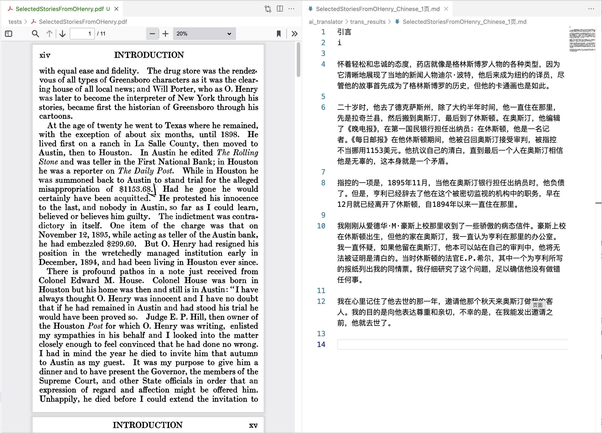

# GLM-Translator

      English | <a href="README-CN.md">中文</a>

    <em></em>

## Introduction

GLM Translator is a tool that uses AI technology to translate English PDF books into Chinese. This tool utilizes large language models (LLMs), specifically the ChatGLM model by Zhipu. It is built with Python and features a flexible, modular, and object-oriented design.

## Why This Project

In the current environment, there is a lack of non-commercial yet effective PDF translation tools. Many users have PDF files containing sensitive data and prefer not to upload them to public commercial services to protect their privacy. This project aims to solve this problem by providing a solution for users who need to translate their PDF files while maintaining data privacy.

## Sample Results

GLM Translator is still in the early stages of development, and I am actively adding more features and improving its performance. Any feedback or contributions are highly welcome!

    <em>"OHenry Novel selected"</em>

    <em>"The Old Man and the Sea"</em>

## Features

- [X] Use large language models (LLMs) to translate English PDF books into Chinese.
- [X] Support for the ChatGLM model.
- [X] Flexible configuration through YAML files or command line parameters.
- [X] Robust timeout and error handling for translation operations.
- [X] Modular and object-oriented design, easy to customize and extend.
- [x] Add support for other languages and translation directions.
- [x] Implement a graphical user interface (GUI) for easier use.
- [x] Implement stylized translation.
- [x] Implement partial page translation (e.g., first x pages).
- [ ] Create a web service or API for use in web applications.
- [ ] Add support for batch processing of multiple PDF files.
- [ ] Add support for retaining the original layout and formatting of the source PDF.
- [ ] Improve translation quality by using custom-trained translation models.

## Getting Started

### Environment Setup

1. Clone the repository.

2. GLM Translator requires Python 3.10 or higher. Install the dependencies using `pip install -r requirements.txt`.
